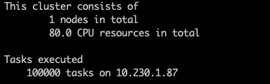
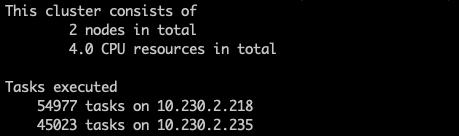

# raytuneLSF

Run distributed ray applications with multinode LSF job submission.

## Requirements
ray == 1.4.1 <br>

## Getting started
Clone repo and cd into the project directory

```
$ conda create -n rayenv python=3.7
$ conda activate rayenv
$ pip install ray==1.4.1
$ git clone https://github.com/oaoni/raytuneLSF.git
$ cd raytuneLSF
```

Run demo ray application: 

#### Local

```
$ python ray_app.py -L
```



#### Distributed via LSF job submission

```
$ python run_job.py\
 -j RayJob\
 --nworkers 2\
 --cpusperworker 2\
 --mempercpu "4"\
 --walltime "0:20"
```


